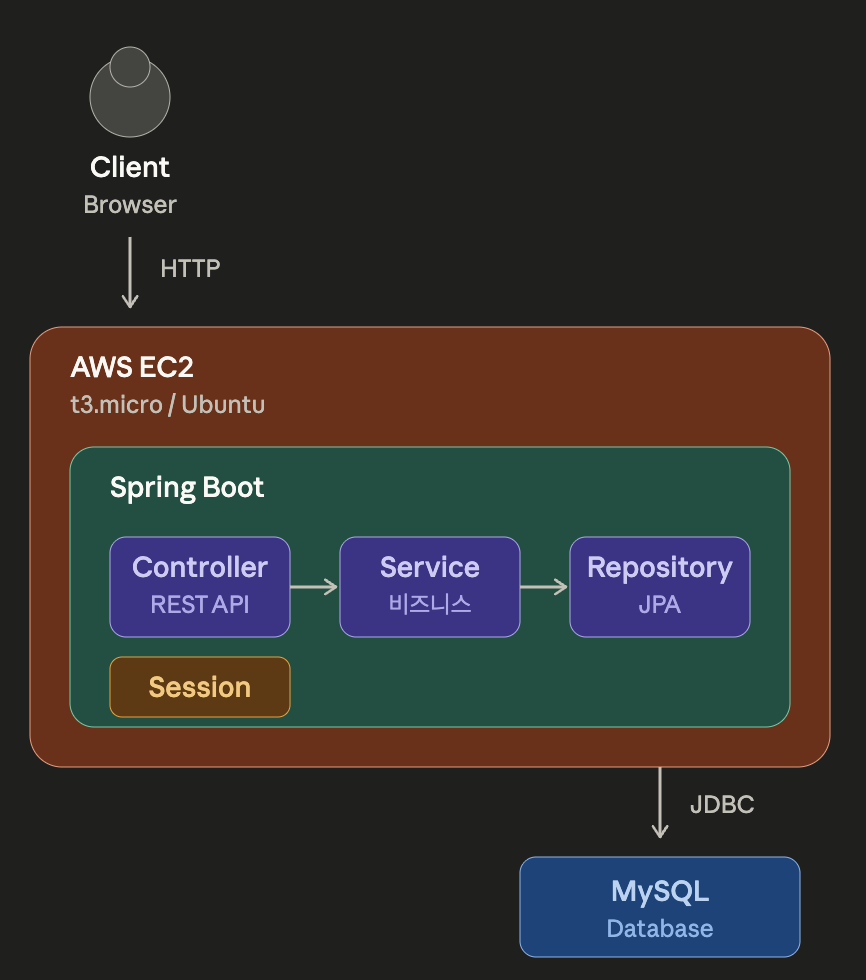

# 회원관리 시스템

Spring Boot 기반의 MVC 패턴 회원관리 웹 애플리케이션입니다.

## 프로젝트 소개

실무에서 자주 사용되는 회원가입, 로그인, 세션 관리 등의 기능을 직접 구현해보며 Spring MVC와 JPA의 동작 원리를 학습하기 위한 프로젝트입니다.

## 기술 스택

| 구분 | 기술 |
|------|------|
| Language | Java 25 |
| Framework | Spring Boot 4.0.5 |
| ORM | Spring Data JPA |
| Template | Thymeleaf |
| Database | MySQL 8.0 |
| Test | JUnit 5, AssertJ |
| Deploy | AWS EC2 (t3.micro) |

## 주요 기능

- **회원가입**: 이메일 중복 검증, 유효성 검사
- **로그인/로그아웃**: 세션 기반 인증
- **로그인 상태 확인**: 세션을 통한 인증 상태 유지

## 아키텍처


## API 명세

| Method | Endpoint | 설명 |
|--------|----------|------|
| POST | /api/members/signup | 회원가입 |
| POST | /api/members/login | 로그인 |
| POST | /api/members/logout | 로그아웃 |
| GET | /api/members/me | 로그인 상태 확인 |

## 실행 방법

### 로컬 환경

```bash
# MySQL 데이터베이스 생성
mysql -u root -p
CREATE DATABASE memberdb;

# 애플리케이션 실행
./gradlew bootRun
```

### 배포 환경

AWS EC2에 배포 완료: http://3.34.126.57:8080

## 테스트

```bash
./gradlew test
```

회원가입, 로그인, 중복 이메일 검증 등의 테스트 케이스 구현 완료

## 프로젝트 구조

```
src/main/java/hello/member/
├── MemberApplication.java
├── controller/
│   ├── MemberController.java
│   └── PageController.java
├── service/
│   └── MemberService.java
├── repository/
│   └── MemberRepository.java
├── domain/
│   └── Member.java
└── dto/
    ├── LoginRequest.java
    └── SignupRequest.java
```

## 학습 내용

- Spring MVC 패턴의 이해 (Controller - Service - Repository)
- JPA를 활용한 데이터베이스 연동
- 세션 기반 인증 구현
- AWS EC2 배포 및 운영
- JUnit을 활용한 테스트 코드 작성